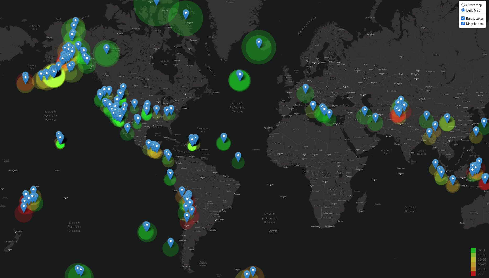

# leaflet-challenge

## task summary:
The USGS provides earthquake data in a number of different formats, updated every 5 minutes. Data was chosen from the USGS GeoJSON Feed page. I selected the dataset that reports earthquakes with a magnitude of 2.5 or greater (from the past week) to visualize. This was translated from a JSON representation of that data to create the visualization. 

I used leaflet to plot the earthquakes, based on the reported longittudes and latitudes. The data markers reflect the magnitude of the earthquake by their size and depth of the earth quake by color. Earthquakes with higher magnitudes appear larger and earthquakes with greater depth appear darker in color. The popup markers for earthquake locations include the location, magnitude, and depth of the quake. A legend is provided to convey the depth of the earthquakes.

## screenshot of complete map:

## note:
I have included a configEDIT.js file within the javascript folder for Leaflet-Step-1. You can edit this file to use your own api key for mapbox (the API used to create this map).

